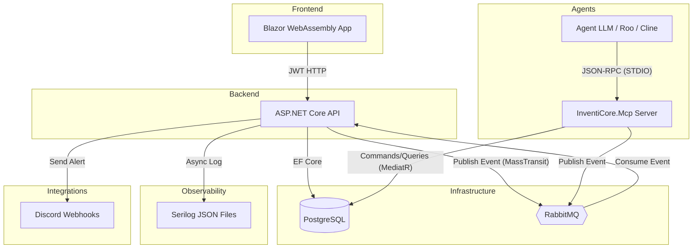

<div align="center">
  
  <h1 align="center">InventiCore SaaS</h1>
  <p align="center">
    O sistema de gestão de estoques distribuídos corporativo (B2B) definitivo. Construído com as melhores práticas de engenharia para aguentar escala, auditoria e automação via Inteligência Artificial.
  </p>
  
  [](https://dotnet.microsoft.com/)
  [](https://dotnet.microsoft.com/en-us/apps/aspnet/web-apps/blazor)
  [](https://blog.cleancoder.com/uncle-bob/2012/08/13/the-clean-architecture.html)
  [](#)
  [](#)
  [](#)
  [](#)
  [](#)
  [](#)
  [](#)
</div>

---

## âš™ï¸  Arquitetura (Visão Geral)

A plataforma InventiCore implementa Clean Architecture rigorosa e separação de responsabilidades em CQRS. Ela conta com Multi-Tenancy (Isolamento nível de Banco de Dados) garantindo a segurança para aplicações SaaS (Software as a Service) B2B.

O diferencial estratégico é a interface acoplada de **Model Context Protocol (MCP)**, permitindo que Agentes de Inteligência Artificial controlem o domínio de estoques através do servidor MCP como "Trabalhadores Autônomos".



## ✨ Funcionalidades Principais

* **Isolamento de Tenants:** Separação total dos dados por cliente através da arquitetura JWT Auth e interceptadores em todo o nível de Repositório EF Core.
* **Model Context Protocol:** Ferramentas corporativas expostas nativamente via STDIO (como `analyze_low_stock` e `execute_stock_transfer`) permitindo integração *Plug & Play* com agentes e LLMs.
* **Audit Trail Imutável:** Todo processo de alteração de estoque gera `StockMovement`, garantindo visão histórica e de conformidade.
* **Dashboards Reativos:** Resumos consolidados B2B com biblioteca `Radzen.Blazor`.
* **Mensageria Orientada a Eventos:** `MassTransit` ouvindo alertas críticos como `StockLowEvent` para notificações em tempo real.
* **Telemetria Centralizada:** Geração estruturada de JSON no Log, possibilitando consumo direto no Datadog/ELK, atrelado explicitamente ao `TenantId`.

## 🚀 Como rodar localmente

### 1. Requisitos
- [Docker](https://www.docker.com/) e Docker Compose
- [.NET 8 SDK](https://dotnet.microsoft.com/download) ou superior
- [Node.js](https://nodejs.org/en/) (opcional, para tools de desenvolvimento)

### 2. Subir a Infraestrutura (Postgres + RabbitMQ)
Abra a raiz do projeto e execute:
```bash
docker-compose up -d
```
Isso iniciará o PostgreSQL na porta `5433` e o RabbitMQ (com painel de gerenciamento) na `5672`/`15672`.

### 3. Subir a API
```bash
dotnet run --project src/InventiCore.Api/InventiCore.Api.csproj
```
A API ficará disponível em: `http://localhost:5030`

### 4. Subir o Frontend (Blazor WASM)
Em outro terminal:
```bash
dotnet run --project src/InventiCore.Web/InventiCore.Web.csproj
```

> **Dica:** O usuário patrão para testes localmente pode ser invocado com login de `admin` e senha `admin` (conforme simulado em nosso ambiente local).

### 5. Ativar as Notificações (Discord)
Adicione o endereço gerado no seu servidor do Discord no arquivo `appsettings.json` da `InventiCore.Api`:
```json
"Discord": {
  "WebhookUrl": "https://discord.com/api/webhooks/..."
}
```
---
<div align="center">
  <i>Construído por Inteligência Artificial (Antigravity Agent) guiado por Engenharia Humana Sênior.</i>
</div>
